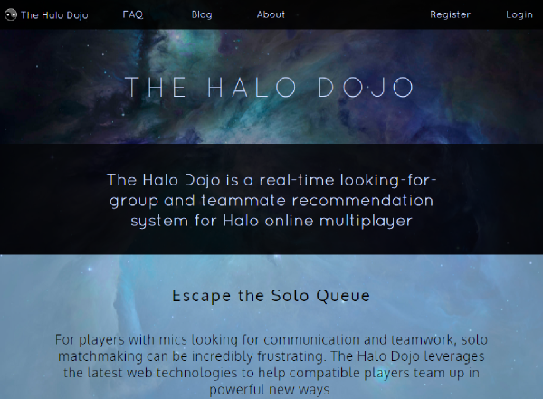
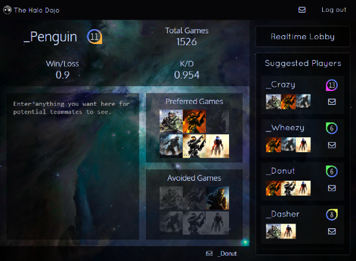
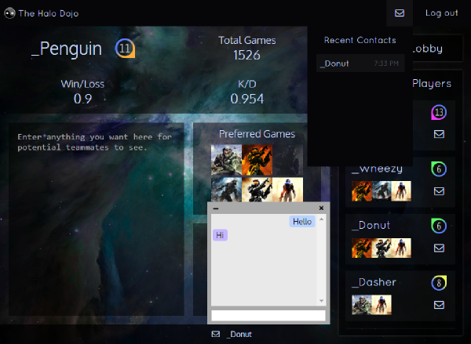
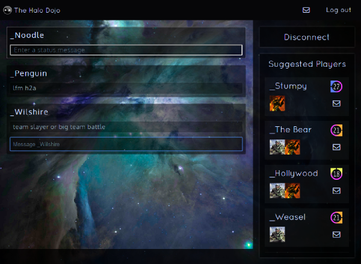

# The Halo Dojo

A real-time looking-for-group and teammate recommendation system for Halo online multiplayer.

## Demo

A [live demo](http://www.thehalodojo.com) is now available. This should be considered merely a prototype or "proof-of-concept" reflecting the current state of development.

### Logging in

The database has been populated with some dummy accounts with random stats, any of which can be logged in with the email [[Gamertag]](https://github.com/AdamStone/halo-dojo/blob/master/scripts/gamertags.txt)`@thehalodojo.com` and the password `password` (replace [Gamertag] with any from the link and replace any spaces with _).

Registering a real account should also work but requires entering a real Xbox Gamertag with a service record for *Halo: The Master Chief Collection* for most functionality.

## Features

Halo is a competitive online game that benefits strongly from effective teamwork and communication. However, so many players on Xbox Live play without microphones that relying on automatic matchmaking to provide random teammates is often a frustrating and discouraging experience (the infamous "solo queue").

This project aims to make it easy to find and team up with compatible players who are interested in teamwork and communication.

### Realtime Search

The realtime search lobby enables players to find other players who are **ready to play** at any given time. Socket.io is used to push updates from the server as players join and leave the lobby, such that the page always stays current. Each player in the lobby can set a status message indicating their preferred playlists, how many teammates they need, or anything else they care to share. They can message other players in the lobby with the built-in chat to quickly arrange to team up.

### Suggested Players

Players can maintain a simple profile describing their preferred and avoided gametypes. These preferences and the players' experience and skill metrics will be used to find similar players and provide a list of potentially compatible teammates.

### Messaging

Suggested players or players in the realtime lobby can be messaged using a built-in messaging app. Messages are saved to the database, and recent conversations can be viewed in the messaging dropdown on the toolbar.

## Technologies used

This is a full-stack JavaScript web application.

**Backend**: <a href="http://nodejs.org/">Node.js</a> server built with <a href="http://hapijs.com/">Hapi.js</a>, and a <a href="http://neo4j.com/">Neo4j</a> graph database.

**Frontend**: <a href="http://facebook.github.io/react/">React.js</a> interface with <a href="http://facebook.github.io/flux/docs/overview.html">Flux</a> application architecture.

**Network**: <a href="https://github.com/hueniverse/hawk">Hawk</a> authentication, <a href="http://socket.io/">Socket.io</a> for messaging and server-initiated updates, <a href="http://visionmedia.github.io/superagent/">Superagent</a> for ajax, and <a href="http://phantomjs.org/">Phantom.js</a> for scraping.

## Screenshots

### Front page:

### Dashboard:

### Messaging:

### Realtime Lobby:

